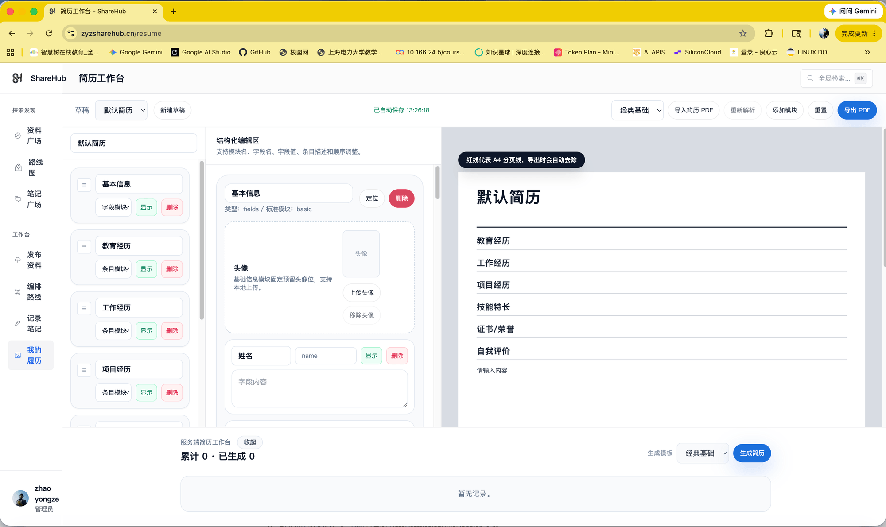
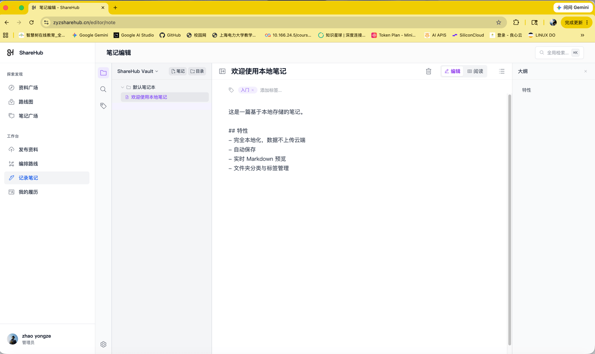
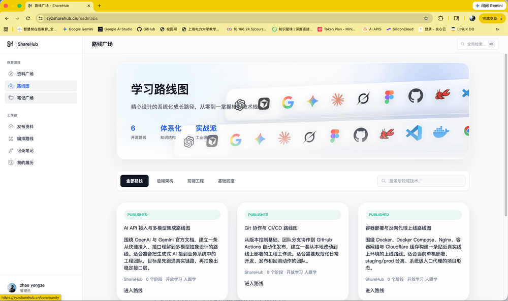
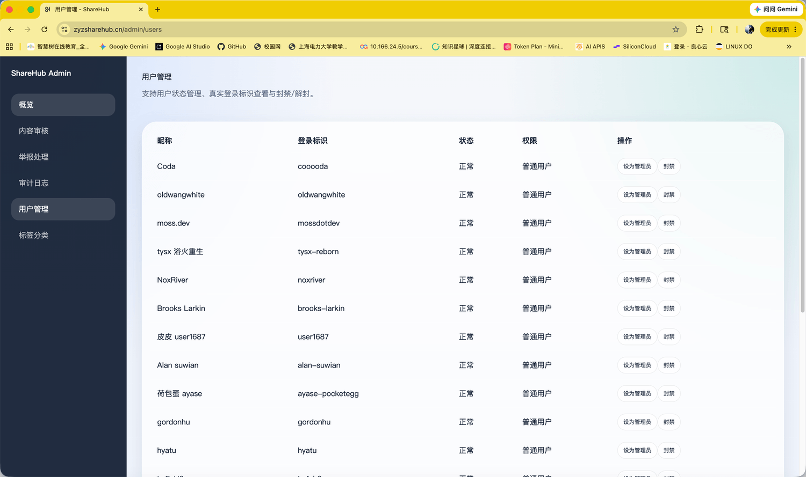

# 📚 ShareHub - 原创资料分享平台

[](https://github.com/zhaoyongze123/zyz-sharehub/stargazers)
[](LICENSE)
[](https://spring.io/projects/spring-boot)
[](https://vuejs.org/)
[](https://www.typescriptlang.org/)

> 🔥 **在线访问**: [https://zyzsharehub.cn](https://zyzsharehub.cn)

ShareHub 是一个面向学习者和创作者的**原创资料分享平台**，围绕资料发布、学习路线、笔记沉淀、简历工作台、互动反馈和后台治理构建完整闭环。

---

## ✨ 功能特色

| 模块 | 说明 |
|------|------|
| 📖 **内容广场** | 原创资料发布、分类检索、标签筛选、热度排序、Markdown 展示、文件上传下载 |
| 🛤️ **学习路线** | 路线发布、节点树管理、用户跟学、进度记录 |
| 📝 **笔记系统** | 笔记广场、本地编辑、收藏浏览、官方推荐 |
| 📄 **简历工作台** | 多模板简历预览、智能解析、PDF 导出 |
| ❤️ **用户互动** | GitHub OAuth 登录、点赞收藏评论举报 |
| ⚙️ **后台治理** | 审核管理、用户管理、审计日志 |

---

## 🖼️ 截图预览

| 首页 | 资料详情 |
|:---:|:---:|
|  |  |

| 学习路线 | 笔记广场 |
|:---:|:---:|
|  |  |

---

## 🛠️ 技术栈

### 后端
<p>
  
  
  
  
  
</p>

### 前端
<p>
  
  
  
  
  
</p>

---

## 📁 项目结构

```
.
├── backend/                 # Spring Boot 后端服务
├── frontend/                # Vue 3 前端应用
├── data/seeds/              # 资料、路线、笔记种子数据
├── deploy/                  # Docker Compose 与 Nginx 部署配置
├── docs/                    # API、部署、发布和专项文档
│   └── screenshots/         # 项目截图
├── scripts/                 # 本地联调、导入、部署、自动化脚本
└── README.md
```

---

## 🚀 快速开始

### 环境要求

- ☕ JDK 17+
- 📦 Node.js 20+ / npm
- 🐘 PostgreSQL 16+
- 🗃️ Redis 7+

### 后端启动

```bash
export JAVA_HOME=$(/usr/libexec/java_home -v 17)
cd backend
mvn spring-boot:run
```

### 前端启动

```bash
cd frontend
npm install
npm run dev
```

### 导入种子数据

```bash
node scripts/import_resources_seed.mjs
node scripts/import_roadmaps_seed.mjs
node scripts/import_notes_seed.mjs
```

---

## 📖 API 文档

- 📄 [OpenAPI 契约](docs/openapi.yaml)
- 📘 [后端接口参考](docs/backend-api-reference.md)

> 💡 本地启动后可通过 `springdoc` 查看交互式 API 文档

---

## 🚢 部署

部署配置位于 `deploy/`：

| 环境 | 配置文件 |
|------|----------|
| 🏭 生产环境 | `docker-compose.prod.yml` |
| 🧪 测试环境 | `docker-compose.staging.yml` |

详细部署文档：
- [部署运行手册](docs/deployment-runbook.md)
- [DigitalOcean 部署指南](docs/deploy-digitalocean.md)
- [发布检查清单](docs/release-checklist.md)

---

## 👨‍💻 关于作者

<div align="center">

### 🔗 联系方式

[](https://github.com/zhaoyongze123)
[](mailto:zhaoyongze@email.com)

### 🏆 统计数据


</div>

---

## 🤝 贡献

欢迎提交 Issue 和 Pull Request！

---

## 📄 License

本项目采用 [MIT License](LICENSE) 开源。